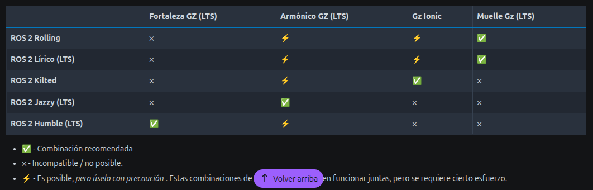

# ROS: Ecosistema de paquetes

Esta guia está realizada para el siguiente setup:
- Linux 24
- ROS Jazzy
- Gazebo Harmonic

En caso de trabajar con otro entorno, determinar la versiónd e cada componente e intentar

## Verificando el entorno de trabajo

Abrir una terminal nuevo y seguir las instrucciones.

### 1. Verificar el directorio de paquetes de ROS

Ejecutar el siguiente comando:

```bash
$ echo $AMENT_PREFIX_PATH
```

Este comando deberia retornar únicamente la ruta de instlación de nuestra distribución de ROS activa. Ejemplo:

```bash
/opt/ros/jazzy
```

#### Problema: Tengo más directorios listados en la variable de entorno.

#### Solución

Si vemos más directorios, seguramente este se este configurando al momento de abrir la terminal. Para el caso de la terminal basada en `bash` podemos ver el archivo de configuración `~/.bashrc`.

En este archivo van a encontrar la siguiente línea:

```bash
source /opt/ros/jazzy/setup.bash
```

Esta línea carga el directorio de de instalación de ROS.

Si detectan otras líneas que realicen un `source` de otro workspace es posible que estén cargando más direcotrios a la variable de entorno, incluyendo paquetes que no deseamos en nuestro entorno de trabajo. Incluso esto puede generar que se sobreescriban paquetes: No utilizan los instalados, utilizan los últimos en incorporar al entorno.

Recomendamos no incorporar otros directorios al entorno de ecosistema de paquetes de ROS, por eso, eliminar o comentar las líneas que incorporen estos directorios y guardar los cambios en el archivo `~/.bashrc`.

#### Verificación

Abrir una terminal nueva y verificar el contenido de la variable de entorno `AMENT_PREFIX_PATH`.

### 2. Verificar la instalación del par ROS-Gazebo

En el curso vamos a utilizar ROS Humble o Jazzy, es importante tener una versión de gabezo acorde a la distro de ROS utilizada.



[Referencia](https://gazebosim.org/docs/latest/ros_installation/)

#### Caso ROS Humble + GZ Harmonic

Es posible utilizar un paquete modificado de Harmonic para trabajar sobre Humble, no es lo recomendado pero lo podemos probar. En este link la guia de instalación: [link](https://gazebosim.org/docs/latest/ros_installation/#gazebo-harmonic-with-ros-2-humble)

