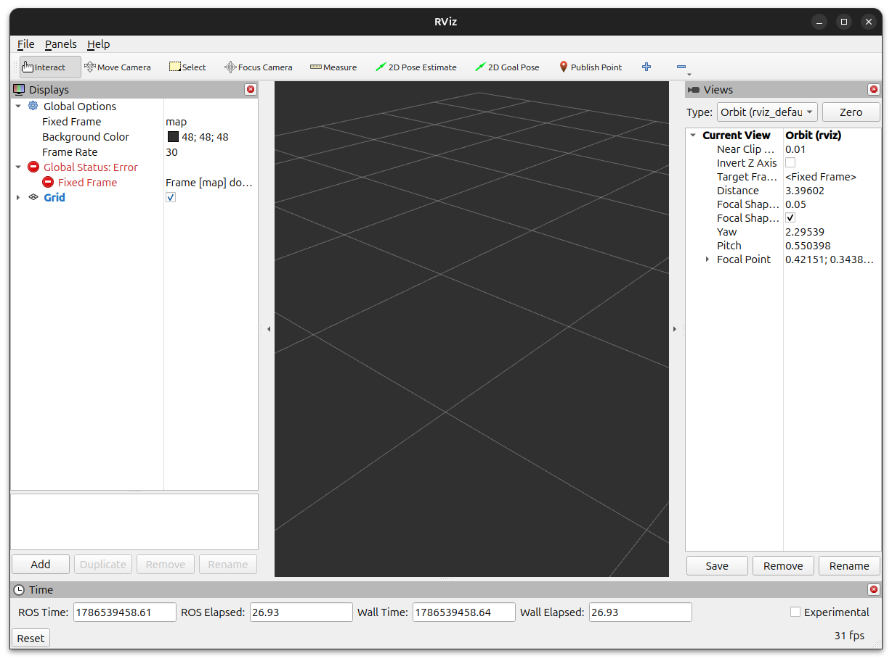

# RViz

Ejecutar RViz
```
$ rviz2
```

## Troubleshooting
- [RViz comienza "CARGADO"](#rviz-comienza-cargado) !!!

## RViz comienza "CARGADO"

Al abrir `RViz` estas usando la configuración por default, si esta configuración parece "CARGADA" la misma se puede limpiar.

***Antes de resetear la configuración por defecto, podes guardarla en un archivo `.rviz para no perderla***

Para resetear la configuración por defecto, ***con la aplicación cerrada***, borrar los archivos `default.rviz` y `persistent_settings` del directorio `~/.rviz2/`

Asi luce el rviz "NO-CARGADO":

