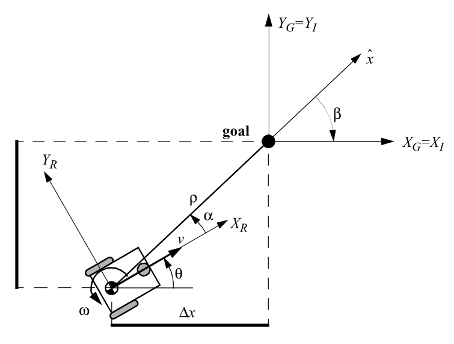

# Control Cinemático de Robots Diferenciales

Referencia: *Introduction to Autonomous Mobile Robots* (Siegwart & Nourbakhsh) **Sección 3.6.2**.

## 1. Modelo Cinemático Global

El modelo cinemático del robot diferencial en el marco inercial se expresa mediante la siguiente ecuación matricial:

$$
\begin{bmatrix} \dot{x} \\ \dot{y} \\ \dot{\theta} \end{bmatrix} = \begin{bmatrix} \cos\theta & 0 \\ \sin\theta & 0 \\ 0 & 1 \end{bmatrix} \begin{bmatrix} v \\ \omega \end{bmatrix}
$$

donde $(x, y, \theta)$ representa la pose del robot, $v$ es la velocidad lineal y $\omega$ la velocidad angular.

## 2. Transformación a Coordenadas Polares

Dada la pose actual del robot $(x, y, \theta)$ y la pose objetivo $(x_g, y_g, \theta_g)$, se definen los errores de posición en coordenadas polares:

* **Distancia al objetivo ($\rho$)**:
  $$\rho = \sqrt{\Delta x^2 + \Delta y^2}$$

* **Ángulo de orientación hacia el objetivo ($\alpha$)**:
  $$\alpha = -\theta + \operatorname{atan2}(\Delta y, \Delta x)$$

* **Ángulo de alineación con la orientación final ($\beta$)**:
  $$\beta = \theta_g - \theta - \alpha$$

> **Nota:** Los ángulos $\alpha$ y $\beta$ deben normalizarse estrictamente en el intervalo $(-\pi, \pi]$.

### 3. Ley de Control Lineal
Las entradas de control para la velocidad lineal ($v$) y angular ($\omega$) están dadas por:

$$v = k_\rho \cdot \rho$$

$$\omega = k_\alpha \cdot \alpha + k_\beta \cdot \beta$$

### 4. Ganancias y Condiciones de Estabilidad Local

Para asegurar la **estabilidad exponencial local** en el origen, las ganancias del controlador deben satisfacer las siguientes condiciones:

$$k_\rho > 0, \quad k_\beta < 0, \quad k_\alpha - k_\rho > 0$$

Las ganancias utilizadas habitualmente en las simulaciones del libro (Ec. 3.59) son:
$$k_\rho = 3, \quad k_\alpha = 8, \quad k_\beta = -1.5$$

