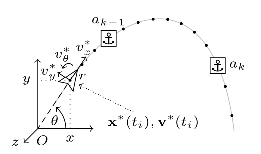
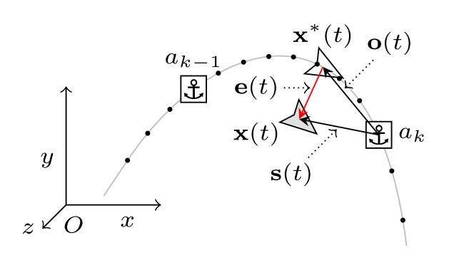
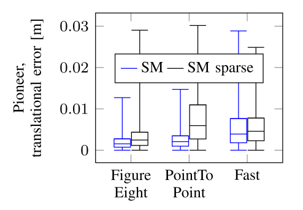

# Resumen del Método Teach-and-Repeat (Sprunk et al., 2013)

- Artículo: **Sprunk et al. (2013)**
- Resumen: Se presenta un marco de navegación **Teach-and-Repeat (TnR)** autónomo para robots móviles basado en **odometría de ruedas** y un **escáner láser 2D (LiDAR)**.

---

## 1. Concepto y Arquitectura General

* **Localización relativa**: Las estimaciones se realizan en marcos de referencia locales vinculados a puntos de anclaje (*anchor points*), evitando la acumulación no acotada de deriva odométrica.

* **Reemplazo del mapa global métrico por un mapa de referencias**: Se crea una mapa de referencias basado en las lecturas del láser 2D y odometria.

---

## 2. Fase de Aprendizaje (*Teach*)

Durante el recorrido guiado por el usuario:
1. **Registro de velocidades y odometría**: Se registran las velocidades $v^*(t_i) = [v_x^*, v_y^*, v_\theta^*]^T$ estimadas por los encoders de las ruedas a intervalos discretos $t_i$. Integrando estas velocidades se obtiene la trayectoria de poses de referencia $x^*(t) = [x, y, \theta]^T \in SE(2)$.

2. **Creación de Puntos de Anclaje (*Anchor Points*)**: Se guardan nodos de referencia $a_k = (l_k, x(t_k))$, donde $l_k$ es el escaneo láser 2D sin procesar y $x(t_k)$ es la pose odométrica asociada.

3. **Criterio de disparo de anclajes**: Se inserta un nuevo *anchor point* cada vez que la distancia recorrida supera un umbral lineal $\tau_l$ (ej. $0.03\text{ m} - 0.07\text{ m}$) o una rotación $\tau_\theta$ (ej. $0.05\text{ rad} \approx 2.9^\circ$). Esto distribuye los datos uniformemente y evita guardar escaneos cuando el robot está detenido.

---

## 3. Fase de Repetición (*Repeat*) y Cálculo del Error

Para reproducir la trayectoria de forma autónoma:
1. **Selección del anclaje más cercano**: Se selecciona el *anchor point* $a = (l_a, x_a)$ más próximo a la posición actual del robot.
2. **Offset de referencia ($o_a(t)$)**: Se calcula el desplazamiento geométrico entre la pose deseada $x^*(t)$ y la pose del punto de anclaje $x_a$:

$$o_a(t) = x^*(t) \ominus x_a$$

3. **Offset medido ($s_a(t)$)**: Un algoritmo de *Scan Matching* compara el escaneo láser actual $l(t)$ con el escaneo del anclaje $l_a$ para obtener la distancia relativa real entre la pose actual $x(t)$ y la del anclaje $x_a$:

$$s_a(t) = x(t) \ominus x_a$$

4. **Error del controlador ($e(t)$)**: La señal de error en el espacio de configuración se obtiene combinando ambos offsets:

$$e(t) = s_a(t) \ominus o_a(t)$$

---

## 4. Control para Robot Diferencial

$$\begin{cases} 
v_x = v_x^* \cos(e_\theta) - \lambda_x e_x \\ 
v_\theta = v_\theta^* - \lambda_y e_y - \lambda_\theta e_\theta 
\end{cases}$$
Donde $\lambda_x, \lambda_y, \lambda_\theta$ son ganancias escalares positivas.

---

## 5. Consideraciones de Implementación

* **Algoritmo de Scan Matching**: Se utiliza la variante de **Iterative Closest Point (ICP) con métrica punto-a-línea**.

* **Semilla de convergencia rápida**: Para garantizar una rápida convergencia del ICP al mínimo correcto, la búsqueda se inicializa componiendo el offset calculado previamente con el movimiento odométrico reciente del robot.

* **Robustez ante la reducción drástica de datos**: Al comparar la versión estándar (*SM*) con una versión dispersa (*SM sparse*), se redujo la cantidad de anclajes en un orden de magnitud, distanciándolos a aproximadamente $\tau_l = 0.5\text{ m}$ o $\tau_\theta = 0.5\text{ rad} \approx 29^\circ$. A pesar de esta enorme disminución de referencias (por ejemplo, reduciendo de 810 a 46 anclajes en la trayectoria *FigureEight*), el error de seguimiento aumentó solo **de manera moderada**.
